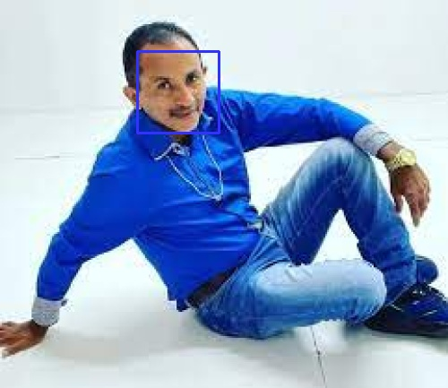
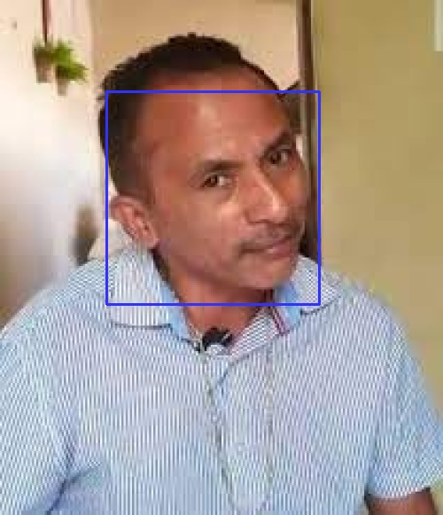
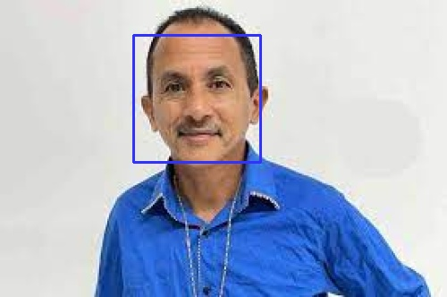
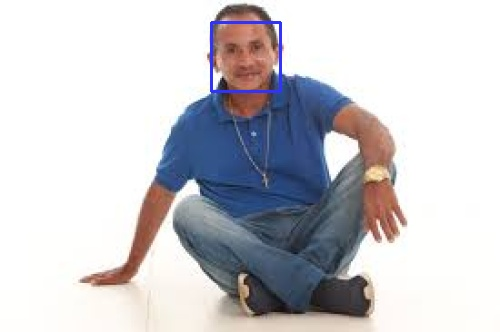

# Inteli-M6-T2-Semana7

## Descrição

Este projeto recebe o input de imagens do rosto de pessoas, e aplica o algoritmo haas cascade para detectar faces. Após a detecção, o algoritmo desenha um retângulo em volta da face detectada, e salva a imagem com o retângulo em uma pasta de saída. Além disso, a imagem também é salva em um banco de dados Sqlite3.

## Instalação

Para executar o projeto, é necessário instalar o Python em versão 3.7 ou superior. Além disso, é necessário instalar as bibliotecas opencv-python e sqlite3. Para instalar as bibliotecas, basta executar o comando abaixo:

```bash
pip install opencv-python
pip install sqlite3
```

## Estrutura do projeto

O projeto está estruturado da seguinte forma:

```bash
├───database_view
│   └───view.py
├───images
│   └───imagem1.jpeg
│   └───imagem2.jpeg
│   └───imagem3.jpeg
│   └───imagem4.jpeg
├───output
│   └───imagem1.jpeg
│   └───imagem2.jpeg
│   └───imagem3.jpeg
│   └───imagem4.jpeg
data.db
database.py
haascade.xml
main.ipynb
README.md
```

O arquivo haascade.xml contém o algoritmo haas cascade para detecção de faces. O arquivo main.ipynb contém o código de leitura da imagem, aplicação do algoritmo e armazenamento do resultado. A pasta images contém as imagens de entrada. A pasta output contém as imagens processadas. A pasta database_view contém o arquivo database.py, que é responsável por exibir as imagens salvas no banco de dados.

## Execução

Para executar o projeto, basta executar o arquivo main.ipynb. O arquivo irá ler as imagens da pasta images, aplicar o algoritmo haas cascade e salvar as imagens com o retângulo em volta da face na pasta output.

Caso desejar salvar as imagens no banco de dados data.db, que são armazenadas no formato de BLOB (objeto binário grande) será necessário executar o comando abaixo:

```bash
python database.py
```

Caso desejar visualizar as imagens salvas no banco de dados, basta executar o arquivo view.py, que está na pasta database_view, para realizar a conversão do BLOB para o formato de imagem da entrada.

## Resultados

Abaixo estão as imagens de entrada e saída do projeto, utilizando imagens do rosto do cantor Manoel Gomes:

### Imagem 1

Entrada


Saída



### Imagem 2

Entrada


Saída



### Imagem 3

Entrada


Saída



### Imagem 4

Entrada


Saída



## Referências

<https://opencv24-python-tutorials.readthedocs.io/en/latest/py_tutorials/py_objdetect/py_face_detection/py_face_detection.html>

<https://pyimagesearch.com/2021/04/05/opencv-face-detection-with-haar-cascades/>

<https://github.com/rmnicola/m6-ec-encontro6>

